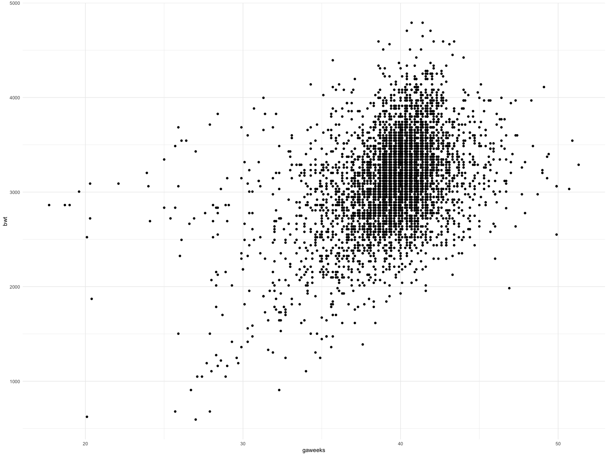
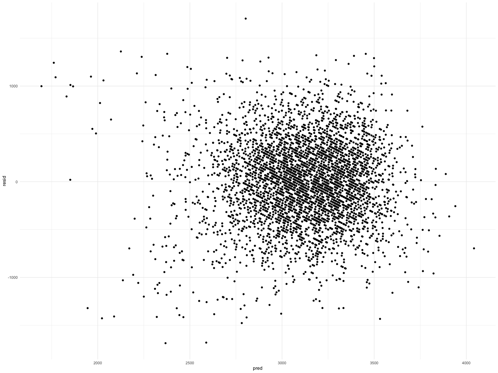
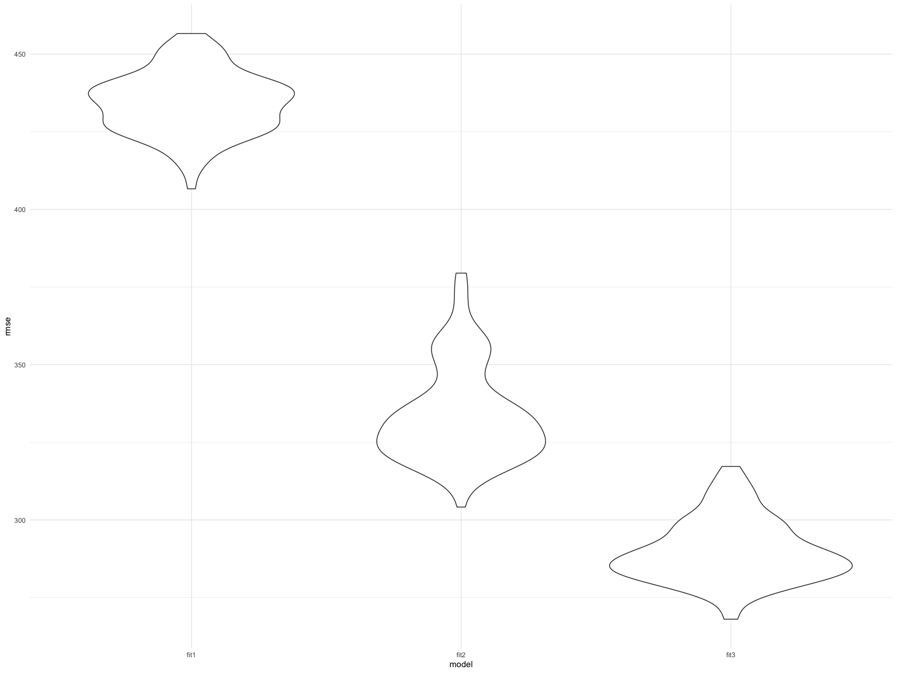
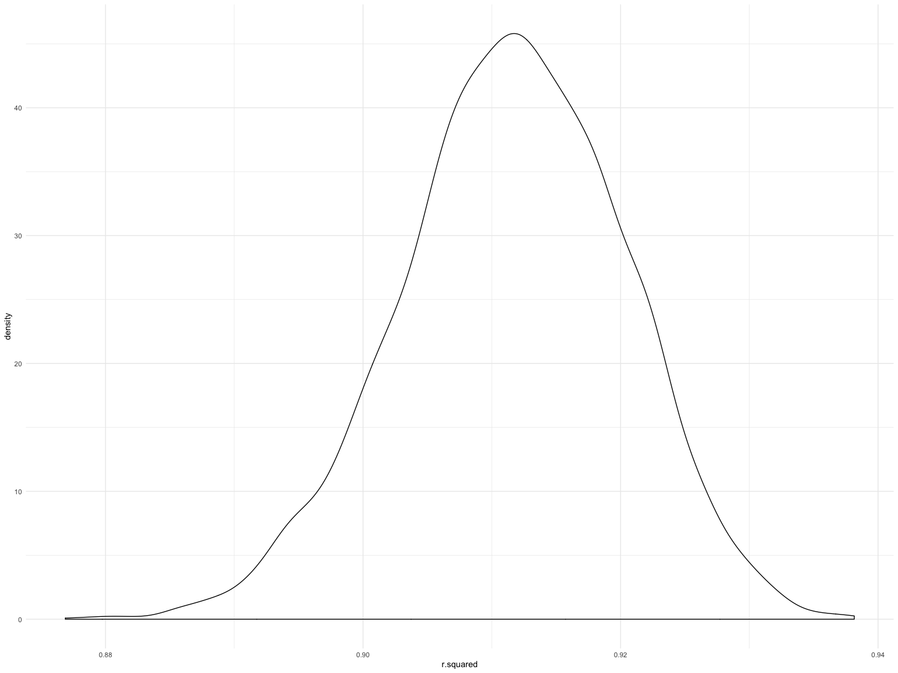
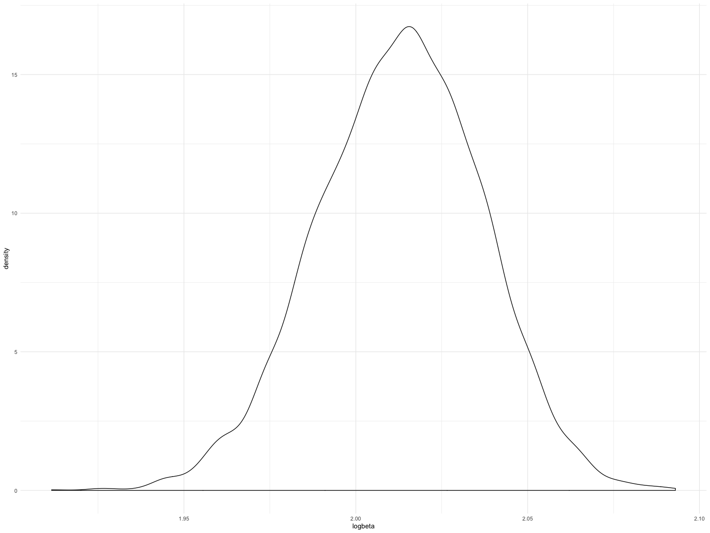

Homework 6
================
Nihan Gencerliler
11/23/2019

## Problem 1

Load and clean birthweight dataset:

``` r
birthweight = 
read_csv("./data/birthweight.csv") %>%
  janitor::clean_names() %>%
 mutate(babysex=fct_inseq(as.factor(babysex)),frace=fct_inseq(as.factor(frace)),
        malform = fct_inseq(as.factor(malform)), mrace = fct_inseq(as.factor(mrace)))
```

    ## Parsed with column specification:
    ## cols(
    ##   .default = col_double()
    ## )

    ## See spec(...) for full column specifications.

``` r
#glimpse(birthweight)
```

The number of missing values is 0.

I started building my model by selecting predictors based on what is
known about factors that influence birthweight. I chose gaweeks, wtgain,
smoken, mrace based on the information
[here](https://www.stanfordchildrens.org/en/topic/default?id=low-birthweight-90-P02382).
Because gestational age is the most important predictor of birthweight,
I plotted it against birthweight to see what the most appropiate fit
would be. The scatterplot suggests linearity, so I will model it as
such:

``` r
birthweight %>%
  ggplot(aes(x=gaweeks,y=bwt)) + 
  geom_point()
```


I then fit a model of birthweight with the four predictors that I
selected. Because all of the predictors are significant, none of them
will be removed.

``` r
fit1 = lm(bwt ~ gaweeks + wtgain + mrace + smoken, data = birthweight)
fit1 %>% 
  broom::tidy() %>%
  knitr::kable()
```

| term        |    estimate |  std.error |   statistic |   p.value |
| :---------- | ----------: | ---------: | ----------: | --------: |
| (Intercept) |   933.62876 | 85.8199362 |   10.878926 | 0.0000000 |
| gaweeks     |    54.86722 |  2.1498383 |   25.521557 | 0.0000000 |
| wtgain      |     9.23159 |  0.6092182 |   15.153175 | 0.0000000 |
| mrace2      | \-290.53028 | 14.3422862 | \-20.256902 | 0.0000000 |
| mrace3      | \-171.52313 | 67.0380050 |  \-2.558595 | 0.0105433 |
| mrace4      | \-183.59312 | 29.5994453 |  \-6.202587 | 0.0000000 |
| smoken      |  \-11.23565 |  0.9206300 | \-12.204302 | 0.0000000 |

Plotting residuals against predicted values:

``` r
modelr::add_residuals(birthweight, fit1) %>%
modelr::add_predictions(fit1)  %>%
ggplot(aes(x = pred, y = resid)) +  geom_point()
```



Model using length at birth and gestational age as predictors (main
effects only):

``` r
fit2 = lm(bwt ~ blength + gaweeks, data = birthweight)
fit2 %>% 
  broom::tidy() %>%
  knitr::kable()
```

| term        |     estimate | std.error |  statistic | p.value |
| :---------- | -----------: | --------: | ---------: | ------: |
| (Intercept) | \-4347.66707 | 97.958360 | \-44.38281 |       0 |
| blength     |    128.55569 |  1.989891 |   64.60439 |       0 |
| gaweeks     |     27.04673 |  1.717930 |   15.74379 |       0 |

Model using head circumference, length, sex, and all interactions
(including the three-way interaction) between these:

``` r
fit3 = lm(bwt ~ bhead * blength * babysex, data = birthweight)
fit3 %>% 
  broom::tidy() %>%
  knitr::kable()
```

| term                   |       estimate |    std.error |   statistic |   p.value |
| :--------------------- | -------------: | -----------: | ----------: | --------: |
| (Intercept)            | \-7176.8170221 | 1264.8397394 | \-5.6740920 | 0.0000000 |
| bhead                  |    181.7956350 |   38.0542051 |   4.7772811 | 0.0000018 |
| blength                |    102.1269235 |   26.2118095 |   3.8962180 | 0.0000992 |
| babysex2               |   6374.8683508 | 1677.7669213 |   3.7996150 | 0.0001469 |
| bhead:blength          |    \-0.5536096 |    0.7802092 | \-0.7095656 | 0.4780117 |
| bhead:babysex2         |  \-198.3931810 |   51.0916850 | \-3.8830816 | 0.0001047 |
| blength:babysex2       |  \-123.7728875 |   35.1185360 | \-3.5244319 | 0.0004288 |
| bhead:blength:babysex2 |      3.8780531 |    1.0566296 |   3.6702106 | 0.0002453 |
| Cross-validation:      |                |              |             |           |

``` r
cv_df = 
  crossv_mc(birthweight, 100) 
cv_df = 
  cv_df %>% 
  mutate(fit1  = map(train, ~lm(bwt ~ gaweeks + wtgain + mrace + smoken, data = .x)),
         fit2  = map(train, ~lm(bwt ~ blength + gaweeks, data = .x)),
         fit3  = map(train, ~lm(bwt ~ bhead * blength * babysex, data = .x))) %>% 
  mutate(rmse_fit1 = map2_dbl(fit1, test, ~rmse(model = .x, data = .y)),
         rmse_fit2 = map2_dbl(fit2, test, ~rmse(model = .x, data = .y)),
         rmse_fit3 = map2_dbl(fit3, test, ~rmse(model = .x, data = .y)))
cv_df %>% 
  select(starts_with("rmse")) %>% 
pivot_longer(
    everything(),
    names_to = "model", 
    values_to = "rmse",
    names_prefix = "rmse_") %>% 
  mutate(model = fct_inorder(model)) %>% 
  ggplot(aes(x = model, y = rmse)) + geom_violin()
```



## Problem 2

``` r
weather_df = 
  rnoaa::meteo_pull_monitors(
    c("USW00094728"),
    var = c("PRCP", "TMIN", "TMAX"), 
    date_min = "2017-01-01",
    date_max = "2017-12-31") %>%
  mutate(
    name = recode(id, USW00094728 = "CentralPark_NY"),
    tmin = tmin / 10,
    tmax = tmax / 10) %>%
  select(name, id, everything())
```

    ## Registered S3 method overwritten by 'crul':
    ##   method                 from
    ##   as.character.form_file httr

    ## Registered S3 method overwritten by 'hoardr':
    ##   method           from
    ##   print.cache_info httr

    ## file path:          /Users/nihangencerliler/Library/Caches/rnoaa/ghcnd/USW00094728.dly

    ## file last updated:  2019-11-24 22:34:28

    ## file min/max dates: 1869-01-01 / 2019-11-30

Create dataset with r-squared and log(beta0\*beta1):

``` r
bootstrap = 
weather_df %>%
  modelr::bootstrap(n = 5000) %>% 
  mutate(
    models = map(strap, ~ lm(tmax ~ tmin, data = .x)),
    tidy = map(models, broom::tidy),
    glance = map(models, broom::glance)) %>% 
  unnest(tidy) %>% 
  select(term,estimate,glance) %>%
  unnest(glance) %>%
  pivot_wider(names_from = "term",
              values_from = "estimate") %>%
  mutate(logbeta = log(`(Intercept)`*tmin))
```

The 95% confidence interval for r-squared is (0.894, 0.927):

``` r
bootstrap %>%
    ggplot(aes(x = r.squared)) + geom_density()
```



``` r
bootstrap %>%
  pull(r.squared) %>%
quantile(probs = c(0.025,0.975)) %>%
  knitr::kable()
```

|       |         x |
| ----- | --------: |
| 2.5%  | 0.8938343 |
| 97.5% | 0.9275407 |

The 95% confidence interval for log(beta0\*beta1) is (1.964, 2.060):

``` r
bootstrap %>%
  ggplot(aes(x = logbeta)) + geom_density()
```



``` r
bootstrap %>%
  pull(logbeta) %>%
quantile(probs = c(0.025,0.975)) %>%
  knitr::kable()
```

|       |        x |
| ----- | -------: |
| 2.5%  | 1.963457 |
| 97.5% | 2.057466 |

The density plots created for both of these terms resemble normal
distributions, as one would expect given the central limit theorem.
